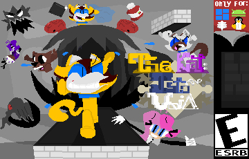
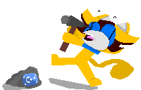

# The Kat: Into the Void!



> Standard Language: **English** | [Cambiar a Español](./README.es.md)

It tells the story of a cat named The Kat, trapped inside the empty stomach of a virus named BRutor.

It's a pixel art game inspired by Nyan Cat: Lost in Space.

## Story

> ### Chapter 1: The Flop-Drivetor
> 
> It all begins at Sylvienee's house. Sylvienee receives an unknown floppy disk labeled "Flop-Drivetor" and inserts it into her computer, only to find a suspicious executable file. When she opens it, the program asks for a superuser password; however, since Sylvienee has an automated command to bypass root authentication, a fish appears on the screen and begins slowly eating away at the computer's pixels, identifying itself as BRutor.
> 
> Sylvienee has the DigiCU-3D created by her engineer cousin Jason, a digitizer that distributes data between the CPU and GPU while also keeping a significant portion in RAM; however, for safety reasons, this data is not erased when the computer restarts.

> ### Chapter 2: Down the Drain
> 
> As Sylvienee digitizes herself, she pulls out her Anti-virus Spray and fires at BRutor but misses; BRutor is very fast.
> 
> At that tense moment, The Kat, Sylvienee’s pet, curiously approaches the computer. Watching Sylvienee fight, the pet calls Starubela, Felix, and Tomy over to take a look, but they accidentally bump into the digitizer and get digitized themselves.
> 
> They see the two fighting, but Sylvienee becomes so distracted by her pets that BRutor seizes the opportunity to de-digitize, causing chaos in the outside world.

> ### Chapter 3: Into the Void!
> 
> Sylvienee gets extremely annoyed and scolds them harshly, but they ignore her and run off, frantically opening files, applications, and commands. Sylvienee screams, "WATCH THE RAM!! IT'S GOING TO REBO-" and a massive OOM-Killer event triggers, automatically restarting the computer.
> 
> Everyone waits for the PC to reboot, feeling somewhat relieved... but BRutor has corrupted GRUB, and a Nyan Cat appears on the screen. Then, out of nowhere, a void swallows them up, and they suddenly materialize in a gray landscape filled with waves and floating objects.
> 
> They all split up except for Sylvienee and The Kat, who stay together and land gently on a floating platform; gravity isn't very strong there, but it feels strange.
> 
> Unfortunately, Sylvienee's flying motorcycle is wrecked, so she sends The Kat to gather alloy to fix it and escape. However, they didn't expect the danger lurking where The Kat is headed: the Shaders, and there is another one way, *way* off in the distance:
> 
> - **Fishoder**: A fish-shaped Shader that swallows you whole.
> - **Shadowner**: A tadpole-shaped Shader that chases you if you get too close.
> - **Pushader**: A spiky-ball-shaped Shader that is always asleep; it isn't hostile, but it deals damage if you touch it.
> - **LongShodernom**: The boss; sharing the same base code, it takes the form of a disgusting red mass of sad faces, encased in armor shaped like a fish with arms and legs.
> 
> #### ...and the adventure is just beginning.

---

## Controls and Gameplay

### Gamepad

- **Button A / X**: Jump (usually 2 Jumps)
- **Button X / □**: Stop
- **Left Stick**: Aim / Swim or Fly towards
- **Right Trigger (RT / R2)**: Shoot

### Mouse and Keyboard

- **Spacebar**: Jump (usually 2 Jumps)
- **X**: Stop
- **Mouse Position**: Aim / Swim or Fly towards
- **Left Click**: Shoot

---

## Setup

### Required Dependencies

- SDL2 Core
- SDL2 Image
- SDL2 TTF
- SDL2 Mixer
- XMake

### Installation

#### Ubuntu / Debian

```bash
sudo apt update
sudo apt install libsdl2-2.0-0 libsdl2-image-2.0-0 libsdl2-ttf-2.0-0 libsdl2-mixer-2.0-0
```

#### Fedora / RHEL

```bash
sudo dnf install SDL2 SDL2_image SDL2_ttf SDL2_mixer
```

### Compilation

```bash
# Clone the repository:
git clone https://github.com/ACarton12E/TheKat-IntotheVoid

# Navigate into the directory and run xmake:
cd TheKat-IntotheVoid
xmake run
```

---

## Game Information

### Technical Data

- **Language**: :hammer: `C++20`
- **Libraries**: `SDL2 (Mixer, TTF, Image)`
- **Build System**: `XMake`
- **Game Version**: `0.1-a bedul`

### System Requirements

#### PC

- **CPU**: Intel Core 2 Duo T7300 (2.0 GHz) / AMD Turion 64 X2.
- **RAM**: 258MB DDR2 RAM
- **GPU**: iGPU (24MB, OpenGL 2.1)
- **Storage**: 258MB | HDD / CD
- **OS**: Linux (all distributions), Windows

#### Mobile (Phone)

- **CPU**: Snapdragon 400 / MediaTek MT6582 (Quad-Core @ 1.2 GHz ARM)
- **RAM**: 258MB RAM
- **GPU**: Adreno 305 / Mali-400 MP2 (Supports OpenGL ES 2.0)
- **OS**: Android only

#### Raspberry Pi

- **Motherboard**: Raspberry Pi 2 Model B
- **CPU**: Broadcom BCM2836 (Quad-Core ARM Cortex-A7 @ 900 MHz)
- **RAM**: 258MB RAM
- **GPU**: VideoCore IV (OpenGL ES 2.0)

#### PinePhone

- **CPU**: Allwinner A64 (Quad-Core ARM Cortex-A53 @ 1.15 GHz)
- **RAM**: 258MB RAM
- **GPU**: ARM Mali-400 MP2 @ 400 MHz

---

Thanks for playing! :)

